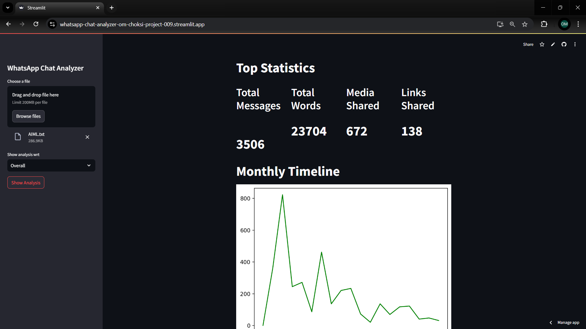
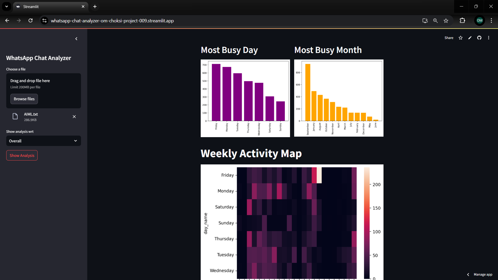
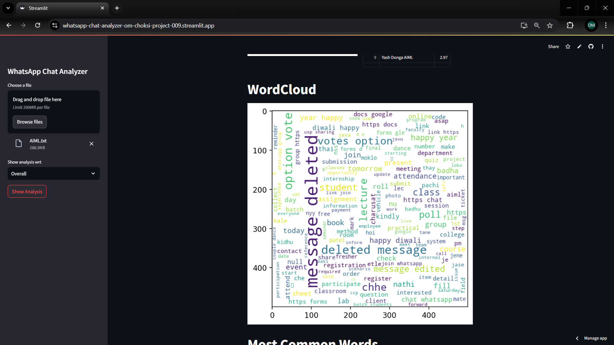

# WhatsApp Chat Analyzer

A Streamlit-based web application to analyze and visualize WhatsApp chat data. This project allows users to upload WhatsApp chat files, processes the data, and generates insightful statistics and visualizations.

---

## Features

- **User Statistics**: Analyze the number of messages, active users, and more.
- **Visualizations**: Generate word clouds, bar graphs, and activity trends.
- **Media Insights**: View media share counts and link statistics.
- **Custom Chat Format Support**: Automatically converts improperly formatted files into a usable format.
- **You can also see a person wise analysis in this App by clicking left side dropdown list**

---

## Getting Started

Follow these steps to set up and run the WhatsApp Chat Analyzer:

### Prerequisites

- Install Python 3.10 or higher.
- Ensure you have the following libraries installed:

```bash
pip install -r requirements.txt
```

---

### Running the Application

1. Clone the repository:
   ```bash
   git clone https://github.com/omchoksi108/whatsapp-chat-analyzer.git
   ```

2. Navigate to the project directory:
   ```bash
   cd whatsapp-chat-analyzer
   ```

3. Run the application using Streamlit:
   ```bash
   streamlit run app.py
   ```

4. Open the link displayed in the terminal to access the application.

Alternatively, use the live application hosted [here](https://whatsapp-chat-analyzer-om-choksi-project-009.streamlit.app/).

---

## Example Output

Below are sample visualizations and outputs you can expect from the application:

### User Statistics


### Activity Trends


### Word Cloud


---

## File Structure

```plaintext
whatsapp-chat-analyzer/
├── app.py                # Main application file
├── preprocessor.py       # Script for cleaning and preparing chat data
├── helper.py            # Contains visualization and analysis functions
├── requirements.txt    # Required Python libraries
├── sample_chat.txt     # Example WhatsApp chat file
└── README.md           # Project documentation
```

---

## License

This project is licensed under the MIT License.

---

## Contributions

Contributions are welcome! Feel free to fork the repository and submit a pull request.

---

## Author

Developed by Om Choksi.

